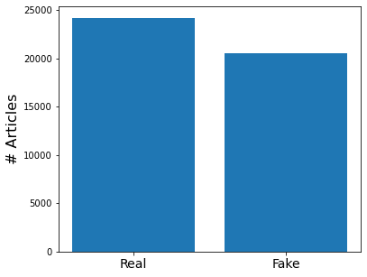
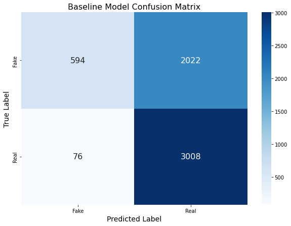
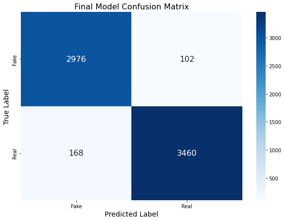
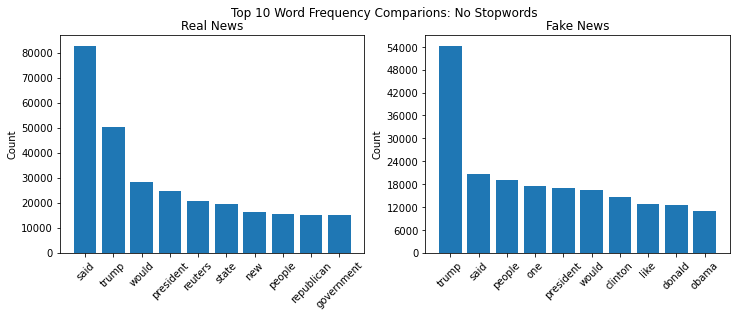

# Fake News Detection


**Author:** Benjamin Toler

## Overview
This prokect uses text data from over 44,000 articles to develop a text classification model that can accuractely identify fake news articles. The data consists of both fake and real news articles from several online publications, primarily Reuters and BuzzFeed. The model is being developed for a the social media company facebook, who is looking to reduce misinformation on their platform. Doing so will imporve their customer experience, and reduce the possibility of any legal issues. The data was loaded and cleaned using the pandas library and split into training, testing, and validation datasets using sklearn. After establishing a baseline model, multiple iterations are developed using differnt data processing techniques from the nltk library such as stopword removal, stemming, and tokenization. Additional feature engineering approaches are taken such as part-of-speech tags, bigrams, and mutual information scores. Lasty, several different classifiers are evaluated. Each model is evaluated based on its training and validation accuracies. The baseline tfidf vectorizer/naive bayes model obtained a 63% accuracy in identifying fake and real news. The final model uses count vectorization and an xgboost classifier, and obatined an accuracy of 96%.

## Business Problem
The social media company facebook is looking to reduce the sharing of misinformation on its platform. Having widespread misinformation on the platform may dicourage new users and may cause the platform to lose existing customers. Additionaly, reducing fake articles on the platform could remove any potential legal issues.

## Data
This project uses multiple datasets of consisting of 44,706 news articles from online publications, primarily Reuters and BuzzFeed. The data is fairly balanced, having about 54% of the data being real news articles and 46% being fake artivles..



## Method
Several model iterations were developed using different vectorization and feature engineering techniques, and differnt classification algorithms. Each model was evaluated by its accuracy on a validation dataset.

## Results
The final model was an XGboost classifier. The data had stopwords removed and was vectorized with sklearn's CountVectorizer. The final model  has a 96% accuracy, which was improved from the basleine model accuracy of 63%. The confusion matrices for the baseline and final model are shown below.




The final model included 100 features. Fake news articles showed a hgiher frequency of political figure names as shown below.


## Conclusions
- **Use model to identify and remove fake news articles from platform:** With a 96% accuracy, facebook can condifidently and quickly idenitfy fake news articles being shared and remove them from the paltform.
- **Provide warnings to users that fake articles have a hiher rate of references of political figures:** The word frequency distributions show that fake news article reference political figures more often the real articles. 
- **Use model to provide a verficiation tag to real articles:** facebook can use this model to confirm the validity of shared articles and tag them as real so that users know they can trust the article.

## Next Steps
- **Expand dataset to inlcude more news categories:** Most of the news articles used in this model relate to domestic and international politics. Explanding the dataset to include categories sucha as sports, science, and entertainment would be useful.
- **Further model iteration using different NLP techniques:** Other feature engineering techniwues such as lemmatization and poitnwise mutual information score could be used to increase the model accuracy. A neural netwrok could be aslo be tried to improve classification accuracy.
- **Determine if similar model can be constructed using only article titles:** the current model uses the full text from articles. A model that uses the title could be more efficient. 

## For More Information

See the full analysis in the [Jupyter Notebook](./Fake_News_Detection.ipynb) or review this [presentation](./presentation.pdf).

For additional info, contact Benjamin Toler at [bentoler22@gmail.com](mailto:alison.bentoler22@gmail.com)


## Repository Structure

```
├── images
├── .gitignore
└── Fake_News_Detection.ipynb
├── README.md
├── presentation.pdf